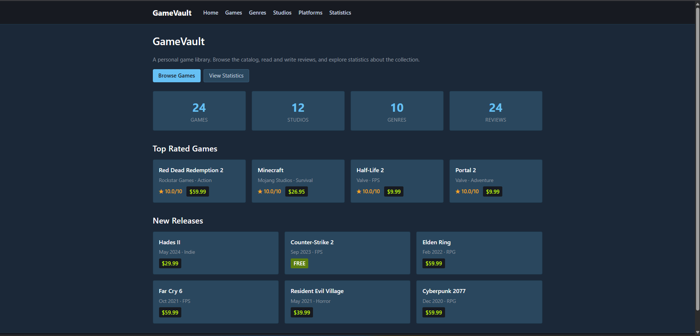
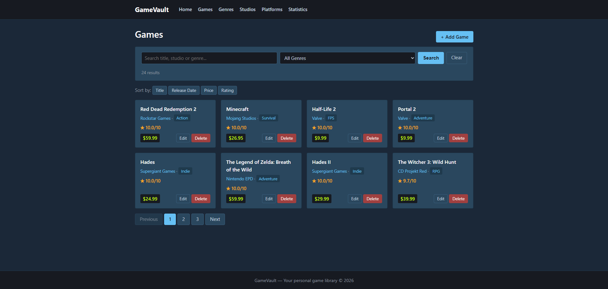
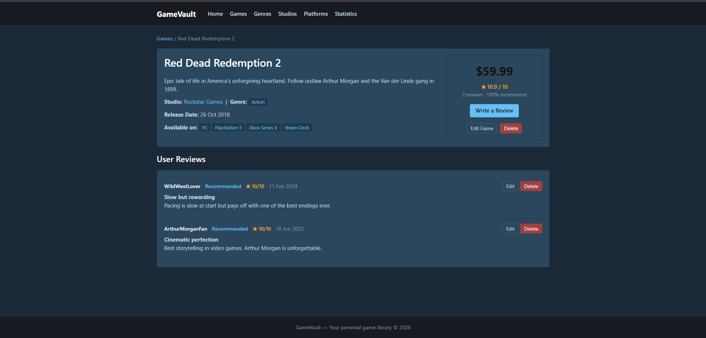
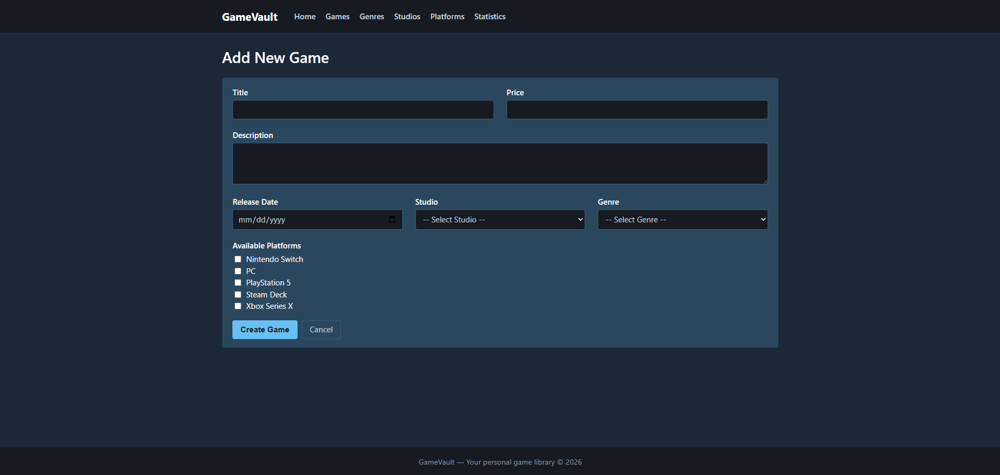
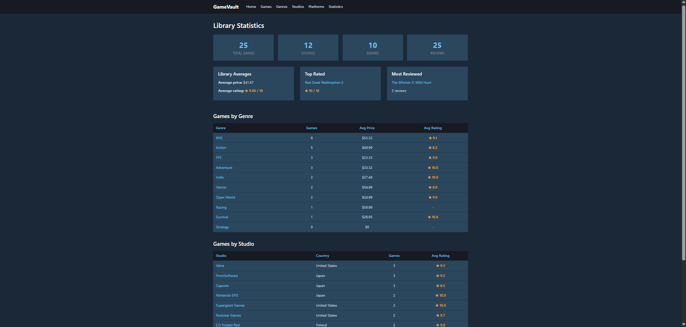
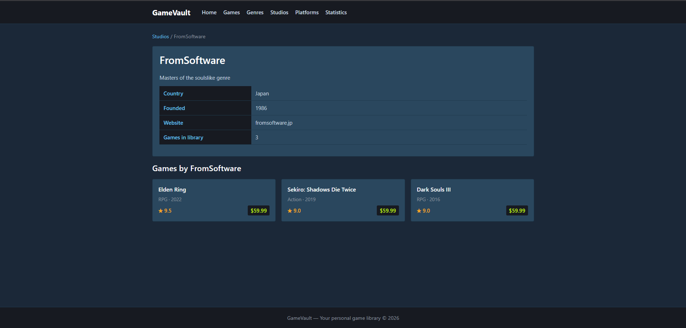
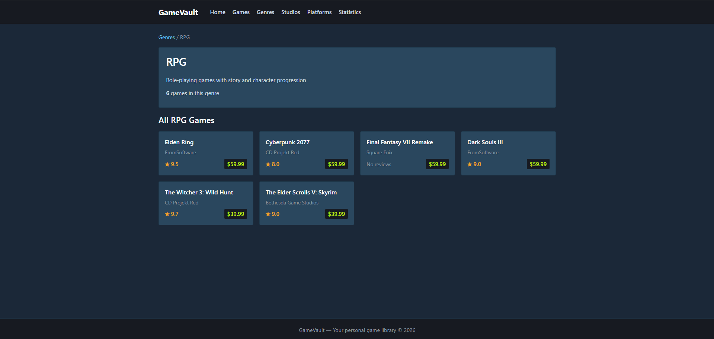
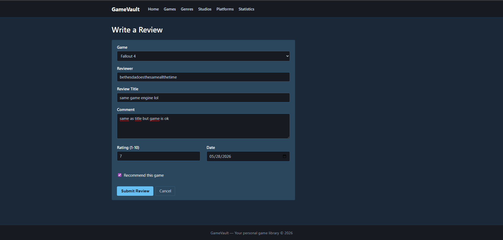
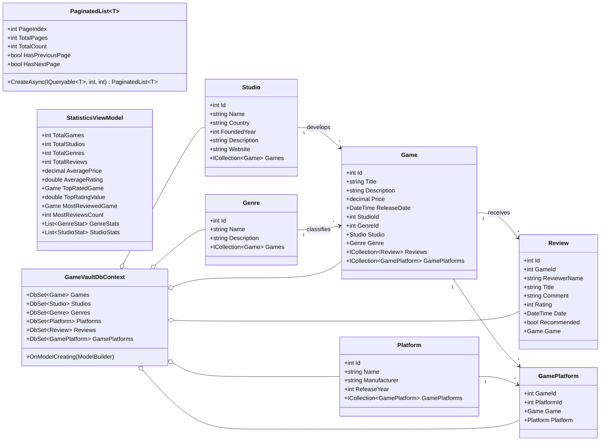

# GameVault
## Documentation – Advanced Programming, Lab 11 / 12

---

## 1. Title and author

**Application title:** GameVault
**Author:** Süleyman Efe Metik
**Course:** Advanced Programming
**Lab:** 11 / 12 – "Pole do popisu 2"
**Lecturer:** dr Łukasz Marchel
**Submission date:** 29-05-2026

---

## 2. Introduction

GameVault is an ASP.NET Core MVC web application that simulates a personal,
Steam-style video-game library. It lets the user browse a catalog of video
games, drill into each game's details, follow links across studios, genres
and platforms, leave their own reviews and explore aggregated statistics
about the whole collection.

The domain has six first-class concepts:

* **Games** – the central entity, each with a title, description, release
  date and price. Every game belongs to exactly one studio and exactly one
  genre, may receive any number of user reviews, and runs on one or more
  platforms.
* **Studios** – game developers / publishers (e.g. Valve, CD Projekt Red,
  Rockstar Games). One studio can have many games in the library.
* **Genres** – game categories (Action, RPG, FPS, Adventure, Strategy,
  Racing, Indie, Horror, Open World, Survival). One genre groups many
  games.
* **Platforms** – hardware platforms on which games run (PC, PlayStation 5,
  Xbox Series X, Nintendo Switch, Steam Deck). Each game can run on
  several platforms and each platform hosts many games.
* **Reviews** – user-written reviews attached to a single game, with a
  1–10 rating, a "Recommended" flag, a free-text comment and a date.
* **GamePlatform** – the explicit junction entity that resolves the
  many-to-many relation between games and platforms, with a composite
  primary key.

Through the application the user can fully manage games (add, edit,
delete, search, sort, paginate, filter by genre), write and edit reviews,
explore studios, genres and platforms with all their associated games,
and view a Statistics page that aggregates library-wide LINQ reports
(average price, average rating, top-rated game, most-reviewed game,
per-genre and per-studio breakdowns).

The project demonstrates every construct asked for in the assignment:
**Entity Framework Core 9 with the Code First approach** on **SQLite**,
**at least three entities linked by navigation properties**, **full CRUD**
for the central entity, **search / sort / paging** in the same controller,
**related-data eager loading with `Include` / `ThenInclude`**, a dedicated
**Statistics** tab driven entirely by LINQ aggregation, and **quick
navigation links** so that every entity name displayed in a list or table
acts as a link to its detail page. The user interface is intentionally
minimal: a hand-written ~290-line `site.css` file (no Bootstrap, no JS UI
framework) gives the application a clean, Steam-inspired dark look that
focuses on the data instead of the chrome.

---

## 3. Work division

The project was completed **individually**.

---

## 4. Git repository

The full source code is available at:

> <https://github.com/bensullu/GameVault>

The repository follows the standard ASP.NET Core MVC layout. The
`main` branch contains the full history; each meaningful change is
recorded as its own commit so the development timeline can be
reconstructed from `git log`.

To clone and run the project locally:

```powershell
git clone https://github.com/bensullu/GameVault.git
cd GameVault/GameVault
dotnet run --urls http://localhost:5020
```

Then open <http://localhost:5020/> in a browser.

Requirements: .NET SDK 9.0. The application is OS-agnostic (tested on
Windows, but uses no Windows-specific APIs).

---

## 5. Detailed list of functionalities

### 5.1 Game catalog (full CRUD + search / sort / paging)

* **Index page** – `GamesController.Index` returns a paginated grid of
  game cards (8 games per page) backed by the reusable
  `PaginatedList<T>` generic. The same action handles search, sort,
  genre filtering and paging at the same time.
* **Search** by title, studio name or genre name. The query is
  case-insensitive and uses `LIKE`-style partial matching through LINQ
  `Contains`. The search box keeps its value across paging and sorting.
* **Sort** by Title (A–Z / Z–A), Release date (oldest / newest), Price
  (low / high) or Average rating (low / high). Sort direction toggles
  on each click and is preserved in the URL query string.
* **Filter** by genre through a dropdown built from the live `Genres`
  table. The filter composes with the search box and stays in the URL
  while paging.
* **Details page** – `GamesController.Details` eagerly loads the
  studio, the genre, all reviews (sorted by date, newest first) and the
  list of supported platforms through `Include` / `ThenInclude`. The
  detail page shows price, average rating, "% recommend" computed from
  reviews, and offers quick links to Write a Review, Edit Game and
  Delete Game.
* **Create / Edit / Delete** – full CRUD for the Game entity. The
  Create and Edit forms include a multi-checkbox for platform
  selection, which the controller persists by rewriting the
  `GamePlatforms` join rows on each save. The Delete action uses a
  confirmation page that re-displays the game's key properties.
* **Pagination** – `PaginatedList<T>.CreateAsync(query, page, size)`
  is a drop-in generic that exposes `PageIndex`, `TotalPages`,
  `HasPreviousPage` and `HasNextPage`. The Games index uses it directly;
  it can be reused in any other listing without changes.

### 5.2 Reviews (full CRUD)

* Reviews can be written either by clicking *Write a Review* from a
  game's detail page (which pre-selects the game) or from the global
  Create-review page, which exposes a game dropdown.
* Each review has a 1–10 rating, a title, a free-text comment, a
  reviewer name, a date and a "Recommended" flag.
* Reviews can be edited or deleted from the corresponding game's detail
  page. Both actions navigate back to the game after submitting.
* The "Recommended" / "Not recommended" labels next to each review let
  the user see at a glance how the reviewer felt about the game.

### 5.3 Studios

* Index of all studios with name, country, founded year, description
  and the number of games in the library.
* Studio detail page lists every game developed by that studio (sorted
  by release date, newest first), together with each game's genre,
  rating and price. Every game card on this page is a clickable link
  to that game's detail page.

### 5.4 Genres

* Index showing every genre with its description and the number of
  games it groups.
* Genre detail page lists all games in that category (sorted by release
  date, newest first), with their studios, ratings and prices.

### 5.5 Platforms

* Index of platforms (PC, PlayStation 5, Xbox Series X, Nintendo
  Switch, Steam Deck) with manufacturer, release year and game count.
* Platform detail page lists every game available on that platform,
  resolved through the `GamePlatforms` junction table.

### 5.6 Statistics tab

The Statistics page is a separate `StatisticsController.Index` action
that materializes a `StatisticsViewModel` made entirely of LINQ
aggregations over the in-memory `DbContext`:

* Total counts: games, studios, genres, reviews.
* Library-wide averages: average price, average rating.
* Highlight cards: the **top-rated game** (highest average review
  rating) and the **most-reviewed game**.
* **Per-genre breakdown** table: game count, average price and average
  rating for each genre, computed with `Count`, `Average` and grouping
  through the navigation property.
* **Per-studio breakdown** table: game count and average rating for
  each studio.

Every row in the breakdown tables links back to the relevant studio /
genre detail page.

### 5.7 Quick navigation

* A persistent top navbar links to Home, Games, Genres, Studios,
  Platforms and Statistics.
* Every entity name shown in a list, table or card is a clickable link
  to its detail page (studio name on a game page → studio details;
  game title on a studio page → game details; genre name in the
  statistics table → genre details; and so on).
* The Home page surfaces the **4 top-rated games** and the **6 newest
  releases** as quick-jump cards.
* Breadcrumbs are shown at the top of every detail page.

### 5.8 Visual design

* Minimal Steam-inspired dark color scheme: page background `#1b2838`,
  card background `#2a475e`, accent `#66c0f4`, gold rating stars
  `#f5a623`, Steam-green price tag `#beee11` and a separate green
  "FREE" badge for free-to-play titles.
* All styling lives in a single hand-written ~290-line `site.css`
  file – **no Bootstrap, no preprocessor and no JavaScript UI library**.
* CSS custom properties (`--bg`, `--bg-card`, `--accent`, `--rating`,
  `--price`, …) keep the palette in one place.
* Sticky footer kept at the bottom of the viewport on short pages with
  a flexbox column layout on `body`.
* Application culture is forced to **en-US** in `Program.cs` so dates
  and currency render in English regardless of the host OS locale.

---

## 6. Pictures and descriptions of interesting parts

The screenshots below were captured from the running application and
are stored in the `screenshots/` folder of the repository.

### 6.1 Home page



The home page opens with a short introduction, four KPI tiles (games,
studios, genres, reviews) and two quick-jump grids: the **top-rated**
games (ordered by average review rating) and the **newest releases**
(ordered by release date). Every card is a link straight to the game's
detail page, so the home page doubles as a fast launchpad into the
catalog.

### 6.2 Games index – search, sort, filter and paging in one screen



The Games index is the workhorse of the application. The toolbar at the
top combines a search box (title / studio / genre, partial match), a
genre dropdown filter and a "Clear" link, all wired to the same
`GamesController.Index` action. Below the toolbar, four sort buttons
toggle the order by Title, Release date, Price or Rating. The grid
itself renders the games as paginated cards (8 per page); the
pagination control at the bottom keeps the active search, filter and
sort in its links so the user never loses context.

### 6.3 Game details – related data through `Include`



The Game details page demonstrates eager loading of related data: the
studio name, the genre tag, the list of platforms (resolved through the
`GamePlatforms` join) and every review (sorted by date, newest first)
are all fetched in a single LINQ query with `Include` / `ThenInclude`.
A side panel shows the price, the average rating, the percentage of
positive reviews, and gives shortcuts to Write a review, Edit and
Delete.

### 6.4 Create / Edit game – many-to-many platform selection



The Create form exposes title, price, description, release date,
studio (dropdown), genre (dropdown) and a checkbox per platform. On
submit, the controller saves the game, then rewrites the `GamePlatforms`
join rows: any existing rows for that game are deleted and a fresh row
is inserted for every checked platform. The Edit form reuses the same
view; pre-checking the platforms is done by looking up the game's
current `GamePlatforms` collection.

### 6.5 Statistics tab – LINQ aggregation



The Statistics tab is a fully LINQ-driven report. The view model is
built from `Average`, `Count`, `OrderByDescending` and grouping queries
on the EF Core context. The page shows total counts, library averages,
the top-rated game card, the most-reviewed game card, and two
breakdown tables (games per genre and games per studio) where the
average rating and price are computed per group.

### 6.6 Studio details – navigation property in action



A studio's detail page lists every game it developed. The list is
produced purely through the `Studio.Games` navigation property in the
controller, and every game card links straight to that game's details –
this is the "quick navigation" requirement from the brief, applied to
the studio side of the relation.

### 6.7 Genre details



The Genre details page mirrors the studio one: it lists every game in
the picked genre through the `Genre.Games` navigation, in reverse
chronological order. Combined with the genre filter on the Games index,
this gives the user two complementary ways of "browsing by genre".

### 6.8 Review form – linked to a game



The review form is launched either from a game's detail page (which
pre-selects the game) or from the global Reviews → Create page (with a
game dropdown). The form captures the reviewer name, a rating (1–10),
title, comment, date and a "Recommended" checkbox. Validation messages
appear inline next to each field through ASP.NET Core's
unobtrusive jQuery validation.

---

## 7. Class diagram

The diagram below is rendered with Mermaid (visible directly on GitHub).
For a printable PDF or Word version you can paste the snippet into
<https://mermaid.live> and export to PNG.



### Relationship summary

| Relation | Cardinality | Implementation |
|---|---|---|
| Studio ↔ Game | 1-to-N | `Game.StudioId` foreign key + `Studio.Games` navigation property |
| Genre ↔ Game | 1-to-N | `Game.GenreId` foreign key + `Genre.Games` navigation property |
| Game ↔ Review | 1-to-N | `Review.GameId` foreign key + `Game.Reviews` navigation property |
| Game ↔ Platform | M-to-N | `GamePlatform` junction with composite key `(GameId, PlatformId)` |

---

## Appendix A – Mapping requirements to source code

| Requirement from the brief | Where it is implemented |
|---|---|
| ASP.NET Core MVC web application | The whole `GameVault/` project (.NET 9, MVC pattern) |
| Entity Framework Core, Code First | `Data/GameVaultDbContext.cs` with `OnModelCreating`; entity classes under `Models/` |
| SQLite as the database | `appsettings.json` connection string `Data Source=GameVault.db`; `UseSqlite` in `Program.cs` |
| At least three model classes linked by navigation properties | Six entities: `Game`, `Studio`, `Genre`, `Platform`, `Review`, `GamePlatform`, all wired through navigation properties |
| Full CRUD for at least one entity | `GamesController` (Index, Details, Create, Edit, Delete – two actions each for POST), plus full CRUD on `ReviewsController` |
| Search, sort and paging in one controller | `GamesController.Index` accepts `searchString`, `sortOrder`, `genreId` and `pageNumber` together; paging via the reusable `PaginatedList<T>` generic |
| Showing related data on a details page through navigation properties | `GamesController.Details` eagerly loads `Studio`, `Genre`, `Reviews` and `GamePlatforms.Platform` with `Include` / `ThenInclude`; the view renders all of them in a single detail screen |
| Statistics tab in a separate place | `StatisticsController.Index` builds a `StatisticsViewModel` from LINQ aggregations; rendered by `Views/Statistics/Index.cshtml` |
| Quick in-app navigation | Persistent navbar in `Views/Shared/_Layout.cshtml`; every entity name in lists / tables is a clickable link to its detail page; Home page surfaces top-rated and newest games |
| Topic-related functionality | Game library specifics: per-game card with price, "FREE" badge, average rating, recommend %; per-game review feed; many-to-many platform availability |
| LINQ queries | `GamesController.Index` (search / sort / filter), `StatisticsController.Index` (aggregations), `HomeController.Index` (top-rated and newest queries) |
| Git version control | The project is tracked in a Git repository (see section 4) |

---

## Appendix B – Build instructions for the lecturer

```powershell
git clone https://github.com/bensullu/GameVault.git
cd GameVault/GameVault
dotnet build
dotnet run --urls http://localhost:5020
```

Then open <http://localhost:5020/> in a browser.

The SQLite database `GameVault.db` is created automatically on first
start and is seeded with sample data (**10 genres, 5 platforms, 12
studios, 24 games and 23 reviews**, plus the game–platform join rows)
by `DbInitializer.Initialize()` called from `Program.cs`. The numbers
shown in the statistics screenshot are slightly higher because a few
games and reviews were added during interactive testing. Every tab is
therefore populated immediately and ready to demo the search, sort,
paging, filtering and statistics flows without any manual data entry.

---

*End of documentation.*
